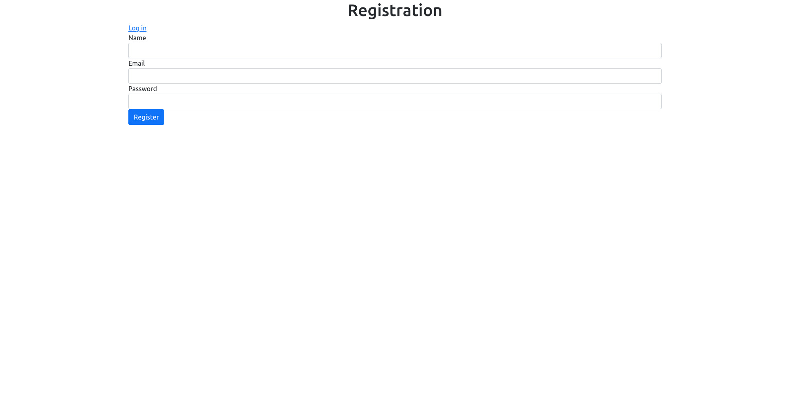
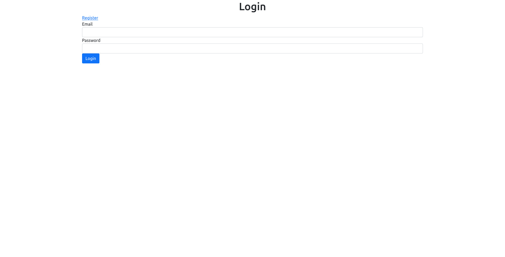
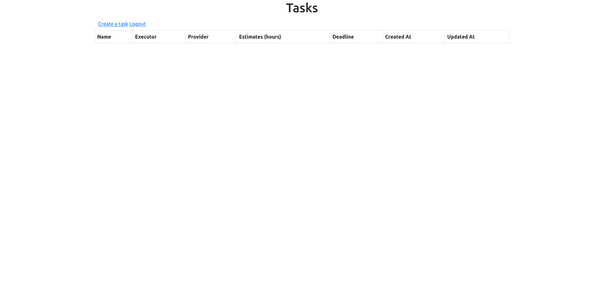
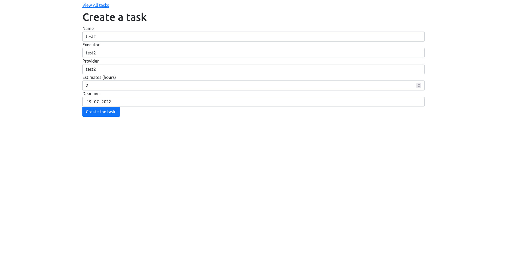
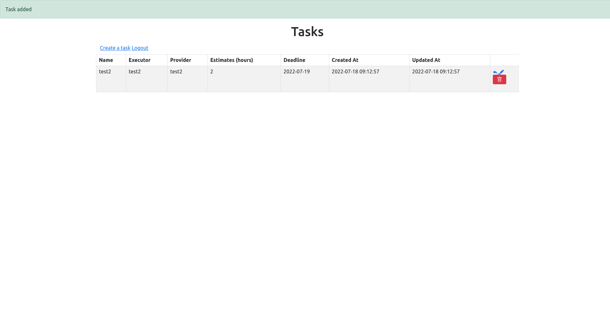
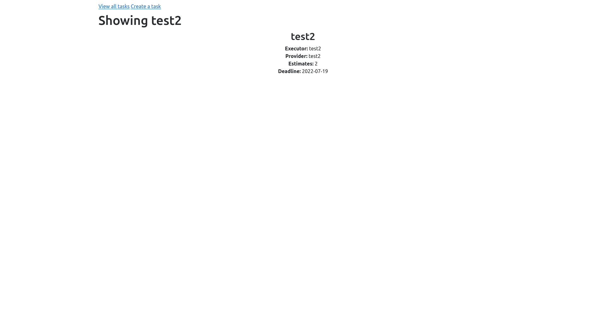
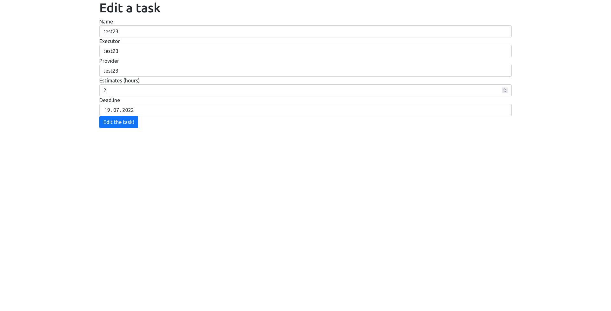
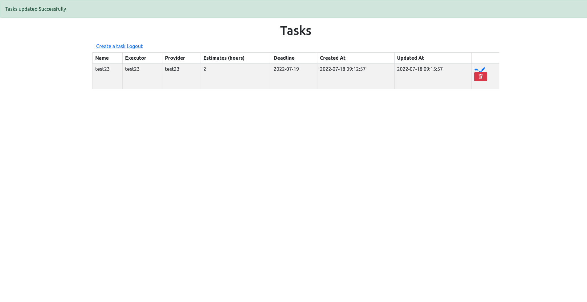
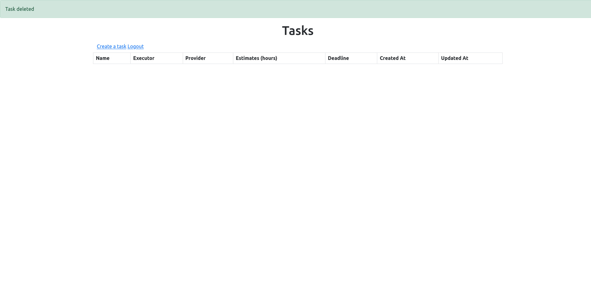

## Make CRUD on Laravel with saving data in MySQL database.

## Technical task:

Application features:
- registration\authorization
- adding new entries
- viewing and editing existing entries
- deleting entries
- use patterns for Laravel(Repository and Factory)
- use Service, Request and Validation

For the front you can use bootstrap.

Create tables implement through migrations.

## Main Page:
_- if not authorized_

_- if authorized_

## Registration

## Authorization

## List tasks

## Create task
_- filling in the data_

_- created task_

## Show one task

## Edit task
_- editing data_

_- edited task_

## Deleting task
